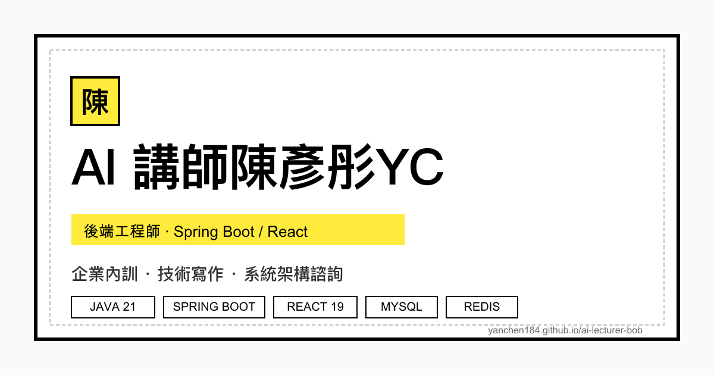

> **TL;DR**
> - 本文解決：「我想買一個個人網域、把 GitHub Pages 站搬過去」這件事，全程交給 Claude Code 跑，使用者只負責「我做不了的事」——刷卡、OAuth 登入、UI 點按鈕。
> - 推薦給：手邊有 `xxx.github.io/repo` 子路徑站、想升級成 `yourname.app` 自有網域、但被「DNS、SSL、redirect、SEO 不要爆掉」這四個關鍵字嚇到不敢動的人。
> - 讀完你會知道：完整 8 步驟、AI 真的能做哪些、哪些一定要你自己做、整個流程大概要多久、SEO 怎麼不會在搬家過程中掉光。



## 📌 目錄

1. [為什麼會想搬家](#為什麼會想搬家)
2. [完整 8 步驟總覽](#完整-8-步驟總覽)
3. [Step 1：選網域 + 比價（AI 主導）](#step-1選網域--比價ai-主導)
4. [Step 2：刷卡買網域（你必做）](#step-2刷卡買網域你必做)
5. [Step 3：DNS 接 Cloudflare（AI 跑、你按按鈕）](#step-3dns-接-cloudflareai-跑你按按鈕)
6. [Step 4：GitHub Pages 綁網域（AI 全包）](#step-4github-pages-綁網域ai-全包)
7. [Step 5：站台程式碼批次改 URL（AI 全包）](#step-5站台程式碼批次改-urlai-全包)
8. [Step 6：跑 CI/CD 部署（AI 全包）](#step-6跑-cicd-部署ai-全包)
9. [Step 7：SEO 不要爆掉（AI 全包 + 你 1 次點擊）](#step-7seo-不要爆掉ai-全包--你-1-次點擊)
10. [Step 8：等 DNS / Google 收割（你等）](#step-8等-dns--google-收割你等)
11. [踩到的 5 個坑](#踩到的-5-個坑)
12. [AI 該做 vs 你該做 對照表](#ai-該做-vs-你該做-對照表)
13. [常見問題](#常見問題)
14. [延伸資源](#延伸資源)

## 為什麼會想搬家

我原本的站長這樣：`https://yanchen184.github.io/ai-lecturer-bob/`。

不要笑，這個 URL 有四個問題：

1. **記不起來**——我自己每次都要打開 GitHub 找 repo 名才會打對
2. **品牌爛**——名片印不出來，介紹給講座主辦方還要拼字「ai 槓 lecturer 槓 bob」
3. **SEO 吃虧**——`*.github.io` 子網域共享頂級域名信任度，個人 repo 路徑底下的 URL 在搜尋結果裡權重比自有網域低
4. **改不了結構**——子路徑站想做 sitemap、做 robots.txt、做網站根目錄的 SEO 工具，會被 GitHub Pages 的「repo 根 = 子路徑」綁住手腳

所以買網域、搬家。這篇是把整個過程跟 AI 一起跑完之後的覆盤——重點不是「教你註冊網域」，而是**「哪些可以丟給 AI、哪些丟不掉」**。如果你已經被太多「點 Cloudflare 第 1 個按鈕、再點第 2 個按鈕」的 step-by-step 文章弄到頭暈，這篇換個角度看——以 AI 為主角，使用者只負責補位。

## 完整 8 步驟總覽

| Step | 動作 | 誰主導 | 大約耗時 |
|------|------|--------|---------|
| 1 | 選網域 + 比價 | AI 主導 | 10 分鐘 |
| 2 | 刷卡買網域 | **你必做** | 5 分鐘 |
| 3 | DNS 設定接 Cloudflare | AI 跑、你按 confirm | 20 分鐘 |
| 4 | GitHub Pages 綁網域 | AI 全包 | 5 分鐘 |
| 5 | 站台程式碼批次改 URL | AI 全包 | 10 分鐘 |
| 6 | 跑 CI/CD 部署 | AI 全包 | 5 分鐘 |
| 7 | SEO 工具設定 | AI 全包 + 你 1 次點擊 | 15 分鐘 |
| 8 | 等 DNS / Google 收割 | 你等 | 24-48 小時 |

人類實際花時間：**約 15 分鐘**。AI 花時間：**約 1.5 小時**（含等 DNS propagate 重試）。

## Step 1：選網域 + 比價（AI 主導）

我給 AI 的指令很短：「我想買 `yanchen` 的個人網域，請查 `.com / .app / .dev / .me` 在 Porkbun 跟 Cloudflare 的價格，給我推薦。」

AI 跑了 `WebFetch` 抓 Porkbun 跟 Cloudflare 的 pricing 頁，給我這張表：

| TLD | 第一年 | 續約 | 適合 |
|-----|-------|------|------|
| `.com` | 沒空位 | — | 經典首選但通常被搶光 |
| `.app` | NT$ 600 | NT$ 600 | 強制 HTTPS（瀏覽器 HSTS preload）、適合工程師 |
| `.dev` | NT$ 480 | NT$ 480 | 開發者圈識別度高 |
| `.me` | NT$ 750 | NT$ 1200 | 續約變貴，不推 |

AI 直接給判斷：**「`.app` 雖然比 `.dev` 貴一點，但你身分是『AI 講師』不是純 Coder，`.app` 的辨識度更廣（一般人也聽得懂 app）。Porkbun 跟 Cloudflare 價格一樣，但 Cloudflare 不能用刷卡優惠買、Porkbun 可以。建議 `yanchen.app` + Porkbun。」**

這種「跨多個來源比較 + 給結論」就是 AI 最划算的場景——你自己手動比要開 5 個分頁，AI 一句話就好。

> 💡 **提醒**：AI 看到的價格可能是當下匯率/促銷的價格，到結帳頁面再對一次。

## Step 2：刷卡買網域（你必做）

這一步**完全不能交給 AI**，三個理由：

1. **金流安全**——Claude Code 的 system prompt 明確禁止它幫你輸入信用卡資訊，這是業界共識的安全紅線
2. **帳號歸屬**——Porkbun / Cloudflare 帳號要綁你的 email、未來續約信會寄給你，AI 用自己的帳號買你也拿不回來
3. **2FA / OTP**——買網域結帳通常要二次驗證，AI 收不到你的簡訊跟 Authenticator code

實際操作：你打開 Porkbun，刷卡買 `yanchen.app`，輸入個資（中文資料的 WHOIS privacy 記得開），結帳完成。

整個流程網頁 UI 很順，5 分鐘。

## Step 3：DNS 接 Cloudflare（AI 跑、你按按鈕）

買完網域後第一個關鍵決策：**DNS 要不要接 Cloudflare**？

AI 給的判斷：「**接**。Cloudflare 提供免費 CDN、DDoS 防護、Analytics、頁面規則（page rules），最關鍵的是後續要做 redirect（舊網址 → 新網址）的時候，Cloudflare 的 page rules 比 Porkbun 自家 URL forwarding 強很多。」

實際流程：

1. 在 Cloudflare 新建一個 site `yanchen.app`，Cloudflare 給你兩個 nameserver（我的是 `anirban.ns.cloudflare.com` + `carrera.ns.cloudflare.com`）
2. 回 Porkbun，把網域的 nameserver 改成 Cloudflare 的這兩個
3. **等 DNS propagate**——這步是整個流程裡最大的「假停滯點」

AI 在這步做的事：

- 自動跑 `dig +short yanchen.app NS @1.1.1.1` 確認 NS 切換
- 跑 `dig` 對多個 resolver（1.1.1.1 / 8.8.8.8 / OpenDNS）——這很重要，因為**單一 resolver 可能有 stale cache**（我們就遇到 1.1.1.1 緩存 Porkbun 舊 NS 將近 30 分鐘，差點誤判 NS 切換失敗）
- 自動驗證 A 紀錄、AAAA 紀錄、CAA 紀錄都對

你要做的事：**登入 Porkbun + 改 nameserver 那 4 個按鈕**——AI 沒辦法登入你的 Porkbun 帳號（同樣 2FA / OTP 問題）。

## Step 4：GitHub Pages 綁網域（AI 全包）

這步是 AI 最爽的一步——`gh` CLI 已經登入你帳號了，AI 可以直接呼叫：

```bash
# AI 自己跑這幾條
gh api repos/yanchen184/ai-lecturer-bob/pages \
  -X PUT \
  -f cname=yanchen.app \
  -F https_enforced=true
```

然後 AI 自動把 `public/CNAME` 檔案寫入（這檔案是 GitHub Pages 用來識別自訂網域的 marker），內容就一行 `yanchen.app`。

接著 AI 跑 `curl -I https://yanchen.app/` 驗證憑證已經由 Let's Encrypt 自動簽發（GitHub Pages 會自動處理，通常 5-10 分鐘就好）。

整步使用者完全不用動。

## Step 5：站台程式碼批次改 URL（AI 全包）

我的站裡共有 **17 個檔案**硬編碼了舊 URL `https://yanchen184.github.io/ai-lecturer-bob`：

- `astro.config.mjs` 的 `site:` 設定
- `.github/workflows/deploy.yml` 的 `PUBLIC_SITE_URL` 環境變數
- `public/robots.txt` 的 `Sitemap:` 行
- `scripts/generate-og.mjs` 產 Open Graph 圖時嵌的 URL
- 13 篇舊文章 markdown 裡引用自己網站連結的 hard-coded URL
- `README.md` 兩處

AI 跑的事：

1. `rg -l 'yanchen184.github.io/ai-lecturer-bob'` 找出全部
2. 一個一個 `Edit` 替換掉
3. 跑 `npm run build` 確認 build 沒掛
4. `git diff` 給我看，等我說「好」就 commit

這種「跨多檔批次替換」就是 AI 完勝人類的工作——人類做一定會漏，AI 用 grep 找完做完還會自己驗一次。

## Step 6：跑 CI/CD 部署（AI 全包）

我的站是用 **Astro 5** + **GitHub Pages**，每次 push 到 master 會觸發 `.github/workflows/deploy.yml`。

AI 直接：

```bash
git add -A
git commit -m "feat(domain): 遷移到自有網址 yanchen.app"
git push origin master
```

然後 AI 自動跑 `gh run watch` 監看 GitHub Actions 進度，5 分鐘後 build + deploy 完成，AI 回報「✓ 部署成功，HTTP 200，URL 已生效」。

中間有一個小插曲：第一次 deploy 完之後 AI 自己跑 `curl https://yanchen.app/sitemap-index.xml` 抓回來檢查，發現 sitemap 裡部分 URL 還是舊網址——是因為某個 React component 把 URL 寫死在 useState 初始值裡 grep 沒抓到。AI 自己回頭找、自己修、自己再跑一次 CI。

**這就是「真的有 AI 幫忙」跟「AI 只是貼 code」的差別**——真正在做事的 AI 會自己驗收、自己除錯、自己往下走，不會在第一個 200 出現的時候就喊完工。

## Step 7：SEO 不要爆掉（AI 全包 + 你 1 次點擊）

搬家最怕 SEO 掉光，這步是整篇最關鍵的部分。

AI 處理的 SEO 工作：

| 工作 | 目的 | 做了什麼 |
|------|------|---------|
| 確認 canonical URL | 告訴 Google 哪個是正主 | 檢查每頁 `<link rel="canonical">` 都指向 `yanchen.app` |
| 確認 og:url | 社群分享預覽圖 | 全部改成新網址 |
| 確認 JSON-LD | structured data | `WebSite` + `BlogPosting` schema 全部用新網址 |
| 舊網址 301 redirect | 保住搜尋排名 | GitHub Pages 自動處理（舊 repo 仍會 301 到 CNAME 目標） |
| sitemap.xml | 提交給搜尋引擎 | 內容全部用新網址，會自動由 Astro 產生 |
| GSC 新增 sc-domain property | Google 認新主人 | 用 DNS TXT 紀錄驗證（AI 寫好紀錄、你貼到 Cloudflare DNS） |
| GSC Change of Address | 通知 Google 整批搬家 | 在 GSC 後台選舊 property → 新 property |

需要你動手的部分**只有兩個**：

1. **登入 GSC 點「驗證所有權」**——AI 不能登入你的 Google 帳號
2. **登入 Bing Webmaster Tools 匯入 GSC 設定**——Bing 接受 Google SSO，5 分鐘就好

值得提的細節：**GSC 的「變更網址工具」（Change of Address）必須等 Google 自己 crawl 一次舊網址、確認真的有 301 redirect 到新網址，才會讓你按「驗證並更新」按鈕**。這通常要 24-48 小時。AI 沒辦法加速這件事，只能標 TODO 提醒你回來點。

## Step 8：等 DNS / Google 收割（你等）

這步沒人能加速，就是等。

期間會發生的事：

- **DNS propagate（0-48 小時）**：全球各地的 DNS resolver 慢慢更新到新的 nameserver
- **Let's Encrypt SSL 簽發（10 分鐘）**：GitHub Pages 自動處理，通常很快
- **Google 重新 crawl 舊網址（24-48 小時）**：看到 301 redirect 之後才會開始把舊 URL 的 SEO 權重轉到新 URL
- **新網址出現在搜尋結果（1-2 週）**：Google 完整 re-index 整個站

期間你站不會掛——舊網址 GitHub Pages 會自動 301 redirect 到新網址，使用者體感無感。

## 踩到的 5 個坑

### 坑 1：1.1.1.1 的 stale cache 害我以為 NS 沒切

切完 NS 之後我用 `dig @1.1.1.1` 查還是 Porkbun 的 NS，差點以為 Porkbun 拒絕了。

**真相**：1.1.1.1 (Cloudflare DNS resolver) 緩存了原本的 NS 紀錄，TTL 沒到不會主動更新。換成 8.8.8.8 + OpenDNS 兩家對驗就立刻看到新 NS 了。

**教訓**：DNS 不要只信一家 resolver，至少兩家對驗。

### 坑 2：`astro.config.mjs` 的 site 預設值忘記改

CI 環境變數設了 `PUBLIC_SITE_URL=https://yanchen.app`，但本地 `npm run build` 時環境變數沒設、會 fallback 到 `astro.config.mjs` 裡面的 `site` 預設值——這個預設值原本還是舊網址，本地 build 出來的 sitemap 就還是舊網址。

**修法**：把 `astro.config.mjs` 裡的預設值也翻成 `https://yanchen.app`，這樣本地、CI 都對。

### 坑 3：GSC Change of Address 按鈕灰掉

選了目的地 property 之後，「驗證並更新」按鈕灰色點不下去。

**真相**：Google 要先 crawl 一次舊網址、確認真的有 301 才會啟動驗證按鈕。沒辦法快轉，只能等 24-48 小時回來再點。

### 坑 4：GitHub Pages 自訂網域要等 SSL 簽發

`gh api ... cname=yanchen.app` 設定完之後，GitHub Pages 後台會顯示 "Enforce HTTPS" 灰掉，因為憑證還沒簽。

**修法**：等 5-15 分鐘 Let's Encrypt 自動簽發完，刷新後就可以勾 HTTPS 強制。**不要急著手動操作**——勾太早會把網域鎖在「等待簽發」迴圈。

### 坑 5：每日 SEO email 報告腳本的 GSC API URL 沒改

我有支 launchd cron job 每天早上跑 GSC API 抓昨日數據寄到我信箱。API 接的 property URL 還是舊網址 `https%3A%2F%2Fyanchen184.github.io%2Fai-lecturer-bob%2F`，跑了整個禮拜空資料才發現。

**修法**：改成 `sc-domain%3Ayanchen.app`（sc-domain property 是 GSC 對「整個域名」的 property type，比 URL-prefix 更精準）。

## AI 該做 vs 你該做 對照表

| 工作類型 | 適合 AI | 適合你 |
|----------|---------|--------|
| 比價、查文件、抓 best practice | ✅ | |
| 跑 CLI（gh / dig / curl / git） | ✅ | |
| 批次替換 17 個檔案的 URL | ✅ | |
| 寫 DNS TXT verification 紀錄、規劃 redirect 規則 | ✅ | |
| 跑 CI/CD、監看 build status、自我除錯 | ✅ | |
| 寫 sitemap、structured data、SEO 設定 | ✅ | |
| 刷卡買網域 | | ✅ |
| 登入 Porkbun 改 nameserver | | ✅ |
| 登入 Google 帳號完成 GSC 驗證 | | ✅ |
| 登入 Cloudflare dashboard 貼 DNS 紀錄 | | ✅ |
| 登入 Bing Webmaster 匯入 GSC | | ✅ |
| 任何需要 2FA / OTP 的步驟 | | ✅ |
| 任何「OAuth 授權同意」按鈕 | | ✅ |

整體原則：**牽涉到「我的帳號是誰」「我的錢」「我同意這個 OAuth scope」這三類動作，AI 不該也不能做**。其他全部丟給 AI。

## 常見問題

**Q1：整個流程多久？**

第一次跑大概 1.5 小時，但你實際只動 15-20 分鐘（刷卡、改 NS、貼 DNS、按 GSC verify、按 Bing import）。AI 在等 DNS propagate、等 SSL 簽發的時候你可以去做別的事。網域生效到 SEO 完整轉移要 1-2 週，但你站從第一天就能用。

**Q2：一定要用 Cloudflare 嗎？Porkbun 自己也能管 DNS。**

不一定。Porkbun 自家 DNS 設 A record / CNAME 也能跑 GitHub Pages。但 Cloudflare 多了：免費 CDN（東南亞讀者載入速度差 200-500ms）、page rules（之後想做 `/old-path → /new-path` redirect 一個 UI 點完）、Analytics（不用塞 GA 也能看流量）。**如果你完全不打算做 redirect 跟 CDN，Porkbun 就夠了。**

**Q3：舊網址 SEO 排名會掉嗎？**

短期會「分散」、長期會「轉移」。Google 看到舊網址 301 redirect 到新網址會把排名權重慢慢轉過去，通常 2-4 週完成。期間搜尋結果裡舊新網址會並存。**關鍵是 301 必須穩定回應 24/7**——別把 GitHub Pages 設定亂改、別把 CNAME 檔案刪掉。

**Q4：AI 為什麼弄了這麼久？步驟感覺很單純啊。**

主因是「等」：等 DNS propagate（多次重試 dig）、等 SSL 簽發（重複 curl 拿 HTTP 200）、等 GSC verify（DNS TXT 紀錄要 Google 自己跑 cron 才會驗）、等 Google crawl 舊網址確認 301（這就吃掉 24-48 小時）。AI 真正在「做事」的時間大概 30 分鐘，剩下都在 polling。**這是基礎設施類任務的本質，不是 AI 慢。**

**Q5：可以一邊跑這流程一邊讓站線上嗎？**

可以。整個遷移過程中你舊站完全不會掛——舊網址照常服務，等新網址生效後變成 301 自動跳轉。使用者完全感受不到搬家。

**Q6：我用的不是 GitHub Pages，用 Vercel / Netlify / Cloudflare Pages 可以套這套流程嗎？**

可以，差別只在 Step 4 的綁定方式：
- **Vercel**：Domains 後台貼網域、它自動給你 A record / CNAME，你回 Cloudflare 貼上
- **Netlify**：類似 Vercel，後台貼網域、自動發 cert
- **Cloudflare Pages**：最爽——同一個 Cloudflare 帳號內，網域跟 hosting 同公司，一個下拉選單綁定

其他 7 步（買網域、改 NS、改 site config、改 SEO、GSC 驗證、Bing 匯入、等收割）完全一樣。

## 延伸資源

- [Porkbun 網域註冊](https://porkbun.com/) — 我用的網域註冊商，介面乾淨、續約價格透明、刷卡有時候有折扣
- [Cloudflare DNS](https://www.cloudflare.com/dns/) — 免費的 DNS / CDN / DDoS 防護，個人站幾乎都該用
- [GitHub Pages 自訂網域文件](https://docs.github.com/en/pages/configuring-a-custom-domain-for-your-github-pages-site) — `gh api repos/...pages` 那組 endpoint 的官方說明
- [Google Search Console](https://search.google.com/search-console) — 自有網域必接，不接看不到自己的曝光跟搜尋表現
- [Bing Webmaster Tools](https://www.bing.com/webmasters/) — 接受 Google SSO，5 分鐘從 GSC 匯入完成
- [yanchen.app](https://yanchen.app/) — 這篇文章描述的最終成品，本站本身

---

如果你正在猶豫要不要搬，建議：**等你下一篇要寫的文章內容你自己都覺得「URL 太醜不想分享出去」的時候，就是時候了**。網域一年 NT$ 600，比一杯星巴克便宜，買下去就是了。

如果你想看更多「AI 主導、人類補位」的實戰流程，可以看看 [我跟 Claude 一起做 frontend-design plugin](/blog/claude-frontend-design-plugin-guide/)、[用 Claude Code skill 把部落格發文流程自動化](/blog/claude-self-sync-intro/)，都是同樣的協作模式。
