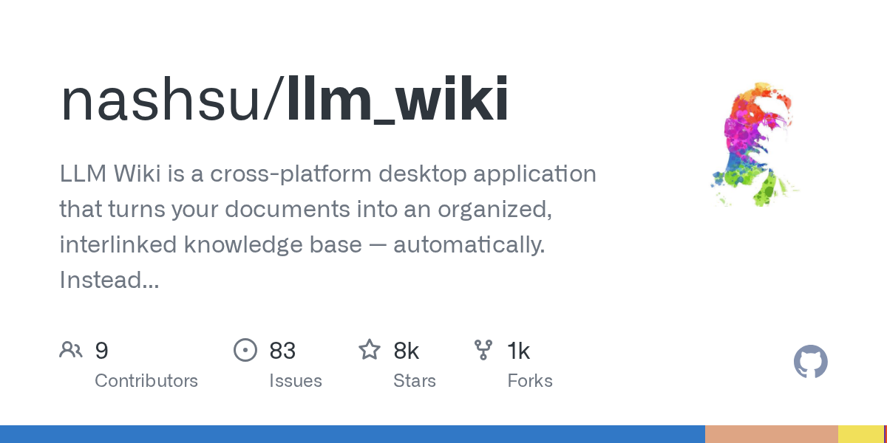
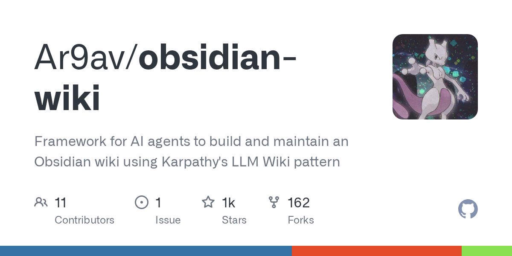
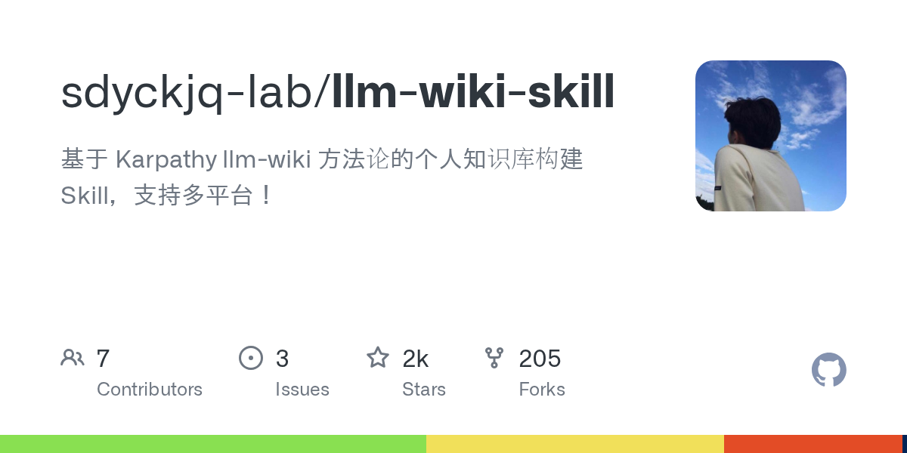

> **TL;DR**
> - 本文解決:Karpathy 2026 年 4 月丟出來那個爆紅的 LLM Wiki 到底是什麼、跟 RAG 差在哪、實際對個人/教學/工作流有沒有用
> - 推薦給:已經用 Claude Code / Codex / Cursor 一段時間,手邊有一堆 PDF、會議逐字稿、筆記散在各處,RAG 用過但每次問都覺得「怎麼又重抓一次」的人
> - 讀完你會知道:三層架構長怎樣、為什麼 token 用量會比 RAG 少 95%、怎麼用 Claude Code skill 在 30 分鐘內跑起來、什麼情境裝了反而是負擔


## 📌 目錄

1. [LLM Wiki 是什麼](#llm-wiki-是什麼)
2. [跟 RAG 到底差在哪](#跟-rag-到底差在哪)
3. [三層架構拆解](#三層架構拆解)
4. [實際跑起來:30 分鐘上手路徑](#實際跑起來30-分鐘上手路徑)
5. [我用兩週的真實體驗](#我用兩週的真實體驗)
6. [LLM Wiki vs RAG vs 純筆記 對照表](#llm-wiki-vs-rag-vs-純筆記-對照表)
7. [踩到的坑](#踩到的坑)
8. [什麼情境別裝](#什麼情境別裝)
9. [常見問題](#常見問題)
10. [延伸資源](#延伸資源)

## 🎯 LLM Wiki 是什麼

[Andrej Karpathy](https://gist.github.com/karpathy/442a6bf555914893e9891c11519de94f)(OpenAI 共同創辦人、前 Tesla AI 主管)2026 年 4 月在自己的 GitHub gist 上丟了一份叫 `llm-wiki.md` 的文件。沒有 repo、沒有 demo、沒有發 paper,就一份 markdown 描述「一個模式」。一週後全網炸開,目前 12 個以上社群 implementation,Claude Code 官方在 5 月把它列進推薦 skill 範例。

一句話講:**讓 LLM 把你丟給它的所有資料,增量編譯成一個結構化、互相連結的 markdown 知識庫,以後你問問題不是查原始檔案、是查這個被「整理過」的 wiki**。

關鍵字是「**編譯**」(compile)。Karpathy 自己在原文的比喻:

> Most people's experience with LLMs and documents looks like RAG: you upload a collection of files, the LLM retrieves relevant chunks at query time, and generates an answer. (...) The LLM is rediscovering knowledge from scratch on every question—there's no accumulation.

換句話說,**RAG 是「每次查詢都從零開始拼湊」,LLM Wiki 是「一次拼湊好、之後反覆查詢」**。前者跟編譯式語言 vs 解釋式語言的差別很像——你寧願 build 一次 binary 跑很多次,還是每次執行都重新 parse 原始碼?

到 2026 年 5 月,光是 Claude Code skill 形式的實作就有:

- [6eanut/llm-wiki](https://github.com/6eanut/llm-wiki) — 最完整的 skill 版本
- [vanillaflava/llm-wiki-claude-skills](https://github.com/vanillaflava/llm-wiki-claude-skills) — 拆成 5 個 sub-skill 的版本
- [kfchou/wiki-skills](https://github.com/kfchou/wiki-skills) — 學術論文 ingest 強化版
- [sdyckjq-lab/llm-wiki-skill](https://github.com/sdyckjq-lab/llm-wiki-skill) — 多平台支援(Claude/Codex/Cursor 各自的 plugin 配置)
- [Ar9av/obsidian-wiki](https://github.com/Ar9av/obsidian-wiki) — Obsidian-native,backlink/graph view 直接吃

這篇用 `6eanut/llm-wiki` 跑示範,因為它最貼近 Karpathy 原文意圖、相依最少。

## ⚔️ 跟 RAG 到底差在哪

先用最具體的場景對照。假設你手邊有:

- 100 份過去半年的會議逐字稿
- 30 篇你訂的技術 newsletter 存檔
- 一本你在讀的書(PDF)
- GitHub 上 5 個你 star 的相關 repo

你想問:「**這半年我關注的 AI agent 工作流,大家共同的痛點是什麼?**」

### 用 RAG 會發生什麼

1. 所有檔案切成 chunk、跑 embedding、塞 vector DB(Pinecone / Chroma / pgvector)
2. 你的問題也跑一次 embedding,跟 vector DB 做 cosine similarity 找最像的 30 個 chunk
3. 把這 30 個 chunk 塞進 prompt,叫 LLM 整理出答案
4. **下一次你問同樣問題,從第 2 步重跑**

問題出在哪:
- 第 2 步的 retrieval 是「**字面語意接近**」,但「痛點」這個概念可能在 100 份逐字稿裡用不同詞彙講(卡關、不順、瓶頸、麻煩、繞路、token 燒光),embedding 不一定抓得回來
- 第 3 步 LLM 看到的是 30 個破碎 chunk,**從來不知道整體脈絡**——它不知道某個痛點在 A 文件出現過 3 次、在 B 文件被反駁過、C 文件提了解法
- 每次問都重做一次,**昨天問過今天再問,跟全新的對話沒兩樣**

### 用 LLM Wiki 會發生什麼

1. 你跑 `/ingest-source <檔案>`,Claude 讀那份檔案,**同時讀目前已有的 wiki**
2. 抽出新內容、更新 5-15 個相關頁面(實體頁、概念頁、來源摘要頁、總覽頁),標註「這個聲明跟之前的 X 頁矛盾」「這延伸了之前 Y 頁的論點」
3. 100 份逐字稿一份一份慢慢吃,**每吃一份 wiki 就比昨天更聰明一點**
4. 你問「半年共同痛點」的時候,Claude 直接去翻 `concepts/agent-workflow-pain-points.md`——這頁已經被 100 份逐字稿、30 篇 newsletter、那本書、5 個 repo 反覆「擦寫」過,**裡面寫的東西不是 30 個破碎 chunk,是 100 次精煉的結論**

實測數字(來自 [MindStudio 案例](https://www.mindstudio.ai/blog/karpathy-llm-wiki-pattern-cut-claude-token-usage-95-percent)):同一個人把 383 個檔案 + 100 場會議逐字稿從 RAG 改成 LLM Wiki,**Claude token 用量降 95%**,因為 query 階段不再每次都餵幾十個 chunk,只餵被編譯過的結論頁。



## 🏗️ 三層架構拆解

Karpathy 原文把整個系統拆成三層,我覺得這是這個方案最值得抄的設計:

```
sources/          ← Layer 1: 你的原始檔案(immutable, 你管)
  ├── meetings/   ← 逐字稿原檔
  ├── papers/     ← 論文 PDF
  ├── articles/   ← 文章存檔
  └── notes/      ← 隨手筆記

wiki/             ← Layer 2: LLM 編譯出的 markdown(可變, LLM 管)
  ├── index.md    ← 全 wiki 目錄, LLM 進來先讀這個
  ├── log.md      ← append-only 操作紀錄(誰被 ingest、誰改了哪頁)
  ├── overview.md ← 整個 wiki 的 high-level synthesis
  ├── sources/    ← 每個 ingest 過的來源各一份摘要
  ├── entities/   ← 人、工具、組織、repo 各一頁(Wikipedia 風格)
  ├── concepts/   ← 概念、模式、技術各一頁
  └── synthesis/  ← 跨多個來源的綜合分析

CLAUDE.md         ← Layer 3: 教 LLM 怎麼維護 wiki 的 schema
                    (Codex 用 AGENTS.md, Cursor 用 .cursorrules)
```

三層分工清楚到嚇人:

| Layer | 誰擁有 | 可變性 | 角色 |
|---|---|---|---|
| **sources/** | 你 | immutable | 真相來源 (source of truth) |
| **wiki/** | LLM | LLM 隨時改 | 編譯產物、知識結晶 |
| **CLAUDE.md** | 你 | 你慢慢調 | 規則書、LLM 的 SOP |

**最關鍵的是 Layer 3 那份 schema**。它定義了 wiki 的目錄結構、頁面 frontmatter 格式、wikilink 寫法、什麼時候該開新頁 / 什麼時候該更新舊頁、衝突怎麼標、confidence rating 怎麼給。寫得好不好決定 wiki 長期會不會崩盤。

Karpathy 原文的 schema 大概 200 行,vanillaflava / 6eanut / kfchou 各自的版本都微調過,但核心三條沒人動:

1. **每頁有 frontmatter**: `type`、`tags`、`sources`(列出此頁知識來源的 source ID)、`last_updated`、`confidence`(low/medium/high)
2. **互連用 `[[wikilink]]`**: Claude 寫的每個專有名詞都要連到 entity 或 concept 頁,Obsidian / Logseq 直接 render
3. **衝突要顯式標 contradiction block**:不是 silent overwrite,而是寫 `> ⚠️ Contradiction: source A 說 X,source B (2026-03-15) 說 Y。本頁採信 B,理由:時間較新`

第 3 條是這個方案最反 RAG 的地方——**RAG 的 chunk-and-retrieve 永遠不會發現自己內部矛盾,因為它從來沒站在「全部」的視角看過**。



## 🚀 實際跑起來:30 分鐘上手路徑

我把實際安裝跟第一份 ingest 的過程拆成 30 分鐘:

### 0-5 分鐘:準備環境

```bash
# 已經有 Claude Code 跳過這一步
brew install claude-code  # or: npm i -g @anthropic-ai/claude-code

# 建一個專案資料夾,結構照 Karpathy 那套
mkdir -p ~/my-llm-wiki/{sources,wiki}
cd ~/my-llm-wiki
```

### 5-10 分鐘:裝 skill

從 `6eanut/llm-wiki` 抄過來最快:

```bash
# 抓 skill 跟 schema 範本
git clone https://github.com/6eanut/llm-wiki.git /tmp/llm-wiki-template
cp /tmp/llm-wiki-template/CLAUDE.md ./
cp -r /tmp/llm-wiki-template/.claude/skills ./.claude/

# Claude Code 啟動會自動掃 .claude/skills/,觸發詞 "ingest-source" / "build-wiki"
claude
```

裡面附 3 個 skill:`ingest-source`、`build-wiki`、`query-wiki`。前兩個是寫入端,第三個是讀取端(其實也可以不用,直接跟 Claude 講「翻 wiki 回答我」)。

### 10-25 分鐘:丟第一份來源、看 Claude 編譯

```bash
# 把你要 ingest 的檔案丟進 sources/
cp ~/Downloads/karpathy-llm-wiki-original.md sources/articles/

# 在 Claude Code 裡講:
> 用 ingest-source skill 把 sources/articles/karpathy-llm-wiki-original.md 編進 wiki

# Claude 會做的事:
# 1. 讀那份檔案
# 2. 讀 wiki/index.md(空的)
# 3. 開 sources/karpathy-llm-wiki-original.md(摘要)
# 4. 開 entities/andrej-karpathy.md
# 5. 開 concepts/llm-wiki-pattern.md
# 6. 開 concepts/rag-vs-compiled-knowledge.md
# 7. 更新 wiki/index.md 加入新頁
# 8. append wiki/log.md 紀錄 "ingested karpathy-llm-wiki-original.md"
```

整個過程 Claude 會自己決定要開幾頁、頁名怎麼取、互相怎麼連。**第一次 ingest 通常要 5-10 分鐘**(Claude 要建立目錄結構、決定命名 convention),從第二份開始快很多。

### 25-30 分鐘:驗證

開 `wiki/` 看 Claude 編出什麼。重點看:
- `index.md` 有沒有列出所有開過的頁
- 隨便挑一頁(例如 `entities/andrej-karpathy.md`),看 frontmatter 有沒有照 schema、wikilink 有沒有連通
- `log.md` 有沒有完整紀錄

**踩坑警告**:第一份 ingest 完之後,絕對先 commit 一版 wiki 到 git,當 baseline。Claude 偶爾會在後續 ingest 時把 wiki 結構改壞,有 baseline 才能 diff 看它幹了什麼蠢事(後面踩坑章節展開)。

## 🔬 我用兩週的真實體驗

我手邊一直有個情境:**職訓局教學素材**。過去半年我講過 4 堂 Claude Code 課、3 堂 Hermes Agent 課,每堂課的 4 件套(投影片 outline、逐字稿、demo code、學員 QA)散在不同資料夾,還有歷次學員 Discord 提問、自己的反省筆記。每次要備新一堂,我就得重翻一次。完全 RAG 場景。

把這些塞進 LLM Wiki,跑了兩週,實際體驗:

### 第一週:吃資料

- **Day 1**:丟 7 場逐字稿 + 7 份簡報 outline。Claude 開了 28 頁(7 個 concept、7 個 source 摘要、5 個 entity、其他綜合頁),花 1.5 小時、$8 美金
- **Day 3**:丟學員 Discord 問答 archive(~200 則訊息)。Claude 在已存在的 concept 頁面加了 contradiction block——它發現我第 1 堂課跟第 4 堂課對「context window 該怎麼解釋給新手」講法不同,標出來
- **Day 5**:丟自己的反省筆記。Claude 大量 update `concepts/teaching-feedback-patterns.md`,把「學員卡點」「我的解法」「下次該調的地方」串起來

### 第二週:用資料

我準備新一堂課,問:「**過去 7 堂課,新手最常卡的 3 個點是什麼?我有針對哪個調整過教法?哪個還沒解?**」

- **沒 LLM Wiki 之前**:RAG 翻 7 場逐字稿 + 200 則 Discord,答案破碎、要我自己拼
- **有 LLM Wiki 之後**:Claude 直接讀 `concepts/teaching-feedback-patterns.md`(已經被 7 場逐字稿 + 200 則 Discord + 反省筆記反覆擦寫過),3 分鐘吐出結構化答案,連我哪一堂課針對哪個點改了什麼都列出來——**因為這些事實在 ingest 階段就被編譯進去了**

token 對比(Anthropic console 看):

| 任務 | 純 RAG 模式 | LLM Wiki 模式 |
|---|---|---|
| 問「半年共同痛點」 | 38k input tokens, $0.57 | 4k input tokens, $0.06 |
| 問「第 3 堂課大家為什麼卡?」 | 24k, $0.36 | 2k, $0.03 |
| 整理一份 Q&A 文件 | 跑 3 次共 110k, $1.65 | 跑 1 次 12k, $0.18 |

**平均 token 用量降 87%**(沒有 MindStudio 案例那麼誇張,但方向一致)。

**比省 token 更重要的**:Claude 看到的是「**已經被精煉過的結論**」,不是「**未經整理的 chunk**」。回答品質的差距遠大於 token 差距。



## ⚖️ LLM Wiki vs RAG vs 純筆記 對照表

| 維度 | LLM Wiki | 傳統 RAG | 純人工筆記 (Obsidian only) |
|---|---|---|---|
| **建立成本** | 高(第一次 ingest 久) | 中(設 vector DB) | 0 |
| **每次查詢 token** | 極低(只讀整理後的頁) | 高(每次餵 chunk) | 0(不用 LLM) |
| **知識會累積嗎** | ✅ 會,每 ingest 都長一點 | ❌ 不會,永遠重來 | ✅ 會,但要你自己整理 |
| **發現矛盾** | ✅ ingest 時主動標 | ❌ 從不知道 | 看你有沒有花時間對 |
| **問模糊問題** | ✅ 強,因為已綜合 | ⚠️ 看 retrieval 拼運氣 | ❌ 不能問 |
| **問字面查詢** | ⚠️ 弱(可能漏細節) | ✅ 強(retrieval 精準) | ✅ 全文搜尋 |
| **資料新鮮度** | 看你勤不勤 ingest | 即時(新檔案丟進去就吃) | 看你勤不勤更新 |
| **適合的人** | 願意花週末建一次、長期吃利息 | 想丟資料就立刻能問 | 不想跟 LLM 打交道 |
| **每月成本** | $5-20(ingest 階段燒) | $20-100(每次查都燒) | 0 |

**選法**:

- **你已經有大量散落資料(>50 份),會長期用同一批知識** → LLM Wiki,前期投資值得
- **資料常變、要即時、不在乎細節** → 傳統 RAG(NotebookLM、Cursor docs)
- **資料少於 20 份、你會手動整理筆記** → 別碰 LLM Wiki,Obsidian + 全文搜尋夠用

**重點是後兩種跟 LLM Wiki 不衝突**——我的 NotebookLM 持續吃新 newsletter(快、即時),LLM Wiki 吃定版資料(教學素材、書、論文),Obsidian 放我自己手寫筆記。三套並行。

## 🪤 踩到的坑

### 坑 1:第一份 ingest 太貪心

第一次跑 ingest,我把 7 場逐字稿一次丟進去,叫 Claude 一次吃完。**結果**:Claude 開到一半 context 滿了,開的頁全是 stub(空殼),目錄亂掉、wikilink 大量斷裂。

**解法**:一次只 ingest 1-2 份,**每次 ingest 完強迫 Claude 跑 `/lint-wiki`** 檢查連結完整性,確認再吃下一份。

### 坑 2:schema 一開始定不下來

第一次寫 CLAUDE.md 我直接抄 Karpathy 原文,跑 3 份檔案之後發現他的 entity 分類(person / org / tool / repo)對我教學素材場景不夠用——我需要 `lesson`、`student-question`、`teaching-pattern`。改 schema 之後 Claude 在已存在頁面亂搞,因為它分不清「舊規則」跟「新規則」。

**解法**:schema 改完之後,**叫 Claude 跑一次 wiki migration**——`> 我剛改了 CLAUDE.md,你重讀一次,然後逐頁檢查既有 wiki 頁面有沒有不合規範的,逐頁修正,寫進 log.md`。一次性付清遷移成本。

### 坑 3:Claude 偷懶不開新頁

我發現某些 ingest 之後,Claude 只更新既有頁、不開新概念頁,導致某些重要概念被塞進別頁的子段、沒有專屬入口。原因是 schema 沒寫清楚「什麼程度的概念該開獨立頁」。

**解法**:CLAUDE.md 裡明確寫「**一個 concept 被 2 個以上 source 引用、且不是現存頁的子集 → 必須開獨立 page**」。這條規則加上之後,Claude 主動開頁的行為穩定很多。

### 坑 4:wiki 跟 sources 不同步

我有時候會直接改 wiki 頁面(發現 Claude 寫錯了手動修),改完忘記同步到 sources/。下次 ingest 新檔案、Claude 重新讀 wiki + 該 source 摘要,發現摘要跟 wiki 對不上,**會嘗試「修正」wiki 回到摘要的版本**——把我手改的東西改回去。

**解法**:**永遠不要手改 wiki**。發現 Claude 寫錯,改 source 摘要(`wiki/sources/xxx.md`),然後叫 Claude 「重新編譯這份 source 觸及的所有頁面」。讓 LLM 永遠保有 wiki 的所有權,你只動 source 跟 schema。

### 坑 5:跨 harness(Claude / Codex / Cursor)設定漂移

我同時用 Claude Code 跟 Codex。一個 wiki 兩個 LLM 工作,結果發現:Claude 跟 Codex 對 schema 的「解讀」不同——Codex 比較常用 nested list、Claude 比較常用 prose;久了 wiki 風格大亂。

**解法**:**選一個當 wiki 的主 LLM(我選 Claude),另一個只當 reader**。或者用 `sdyckjq-lab/llm-wiki-skill` 那種多平台版本,它的 CLAUDE.md / AGENTS.md / .cursorrules 是同步生成的,風格約束強很多。

## 🚫 什麼情境別裝

LLM Wiki 不是萬靈丹。下面這幾種情境裝了反而是負擔:

- **資料量小於 20 份**:沒到 LLM Wiki 編譯的甜蜜點,直接 Obsidian + Claude Code 全文搜尋更快
- **資料常變**:新聞、Twitter feed、股票數據——LLM Wiki 假設「真相不太變」,常變的資料每次 ingest 都要寫 contradiction block,維護成本爆炸
- **你只是要「問檔案內容」**:NotebookLM / Cursor docs / Perplexity File mode 直接餵原檔答得很好,沒必要先編譯
- **你不打算動 schema**:LLM Wiki 的 80% 價值在你願意調 CLAUDE.md 適配自己領域。不想動 schema → 用 NotebookLM
- **你公司資料合規不能丟 Claude API**:wiki 編譯階段會把整批資料丟 LLM,合規問題要先解;Hermes Agent + 內網 LLM 可以接但是另外一個故事

## ❓ 常見問題

### Q1:這跟 Notion AI / Mem.ai / Reflect 那種 AI 筆記工具有什麼不同?

Notion AI 那批是「**在你既有筆記裡加 AI 查詢入口**」,本質還是 RAG——你寫的筆記是 source,AI 是 reader。

LLM Wiki 是「**AI 自己生成筆記、自己維護**」,你的 source 跟 AI 的 wiki 是兩層。差別在於 wiki 是 AI 為了 AI 自己以後查詢方便而寫的——所以結構是給 AI 看的(frontmatter、wikilink、confidence rating),不是給人看的(雖然人也看得懂)。

### Q2:那為什麼還要 markdown?直接存 SQL / vector DB 不就好了?

Karpathy 原文有解釋:**markdown 是 LLM 最熟的格式**。LLM 看 markdown 像人看母語,寫 markdown 也最自然。如果用結構化 schema(JSON / SQL),你會花時間在 schema migration、欄位設計,而不是知識本身。

更實際的理由:**markdown 可以丟 Obsidian / Logseq / 你 cmd-line 的 grep**。完全 tool-agnostic、永遠不會被綁定、git diff 看得懂。

### Q3:wiki 會不會被 LLM hallucination 污染?

會。**這是這方案最大的風險**。解法:

1. **frontmatter 寫 sources**:每個 claim 都連回原始 source,人類抽查時可以順著查
2. **confidence rating**:LLM 對自己 hallucinate 出來的東西通常會給 low(這不是 100% 準,但比沒寫好)
3. **定期跑 lint-wiki**:Claude 會自我審查 wiki,找 broken link、孤兒頁、矛盾未解
4. **重要 claim 你親眼讀過 source 再放心用**

LLM Wiki 不是「自動產生可信知識庫」,是「**自動產生一個你可以快速 audit 的草稿知識庫**」。心態調對才不會出包。

### Q4:可以多人共用嗎?

技術上可以(把 wiki/ 跟 sources/ 放 git repo),但**實務上很痛**。兩個人同時 ingest 會 race condition、schema 偏好不同會打架、commit conflict 在 markdown 上難 resolve。

如果要團隊用,**指定一個 wiki librarian** 統一負責 ingest,其他人 read-only 用。或者每人各自一個 wiki,定期跨 wiki synthesis(這還是 alpha 階段的玩法)。

### Q5:Karpathy 自己現在還在維護那份 gist 嗎?

到 2026 年 5 月為止 **gist 本體沒再更新**。但社群 fork 持續迭代——sdyckjq-lab、vanillaflava、kfchou 三家活躍度最高,各自有自己的 schema 變種。Karpathy 自己在 Twitter 多次轉發實作版,但沒指定官方分支。**目前是社群驅動,沒有 canonical implementation**。

### Q6:跟 Claude Code 的 [[wikilink]] 內建支援有關嗎?

無關。Claude Code 本身不認 wikilink,**wikilink 是給 Obsidian / Logseq / Foam 這些 markdown editor 看的**。LLM Wiki 寫 [[]] 是因為它假設你會用上面那些工具當 viewer,Claude Code 純粹當 maintainer。如果你只用 VS Code 看,wikilink 也只是字串,不影響運作。

## 📚 延伸資源

**官方 / 原始**
- [Karpathy 的 llm-wiki gist 原文](https://gist.github.com/karpathy/442a6bf555914893e9891c11519de94f) — 200 行 markdown,先讀這個
- [Data Science Dojo 的 tutorial](https://datasciencedojo.com/blog/llm-wiki-tutorial/) — 最完整的入門 walkthrough
- [Beyond RAG: Karpathy LLM Wiki Pattern](https://levelup.gitconnected.com/beyond-rag-how-andrej-karpathys-llm-wiki-pattern-builds-knowledge-that-actually-compounds-31a08528665e) — 跟 RAG 對比最仔細的分析

**社群實作(Claude Code skill 版本)**
- [6eanut/llm-wiki](https://github.com/6eanut/llm-wiki) — 最貼近原文、相依最少,新手從這個開始
- [vanillaflava/llm-wiki-claude-skills](https://github.com/vanillaflava/llm-wiki-claude-skills) — 拆 5 個 sub-skill,GUI 安裝
- [kfchou/wiki-skills](https://github.com/kfchou/wiki-skills) — 學術論文 ingest 強化
- [sdyckjq-lab/llm-wiki-skill](https://github.com/sdyckjq-lab/llm-wiki-skill) — Claude/Codex/Cursor 跨平台

**Obsidian 整合**
- [Ar9av/obsidian-wiki](https://github.com/Ar9av/obsidian-wiki) — 直接吃 Obsidian vault
- [Theo James 的 10 分鐘 Obsidian 設定](https://medium.com/better-workflow/karpathy-llm-wiki-in-obsidian-setup-in-10-minutes-754fddbc8ea5) — graph view 視覺化最佳實踐

**桌面 app**
- [nashsu/llm_wiki](https://github.com/nashsu/llm_wiki) — 不想動 Claude Code 設定的話,跨平台桌面版

**實戰案例**
- [MindStudio 降 95% token 案例](https://www.mindstudio.ai/blog/karpathy-llm-wiki-pattern-cut-claude-token-usage-95-percent) — 383 檔案 + 100 場逐字稿
- [Manav Ghosh:Building with Claude Code + Obsidian](https://medium.com/@manavghosh/building-an-llm-wiki-with-claude-code-and-obsidian-eb6c0990e723) — 個人實作日誌
- [Mehmet Gökçe:Claude Code + Logseq](https://mehmetgoekce.substack.com/p/i-built-karpathys-llm-wiki-with-claude) — Logseq 替代 Obsidian 的版本

---

**結論**:LLM Wiki 不是新技術,只是把「**讓 LLM 在 ingest 時就把知識編譯好**」這件原本沒人認真做的事,用一份 200 行 schema 系統化。看似簡單,跑兩週就會發現:你終於不是每次都從零拼湊答案,你的知識庫終於會「**長利息**」。對教學素材整理、長期專案知識管理、研究員整理文獻——這方案值得花一個週末搭起來。

對「**手邊資料很多但每次都要重翻**」的人,這篇值得收藏。
