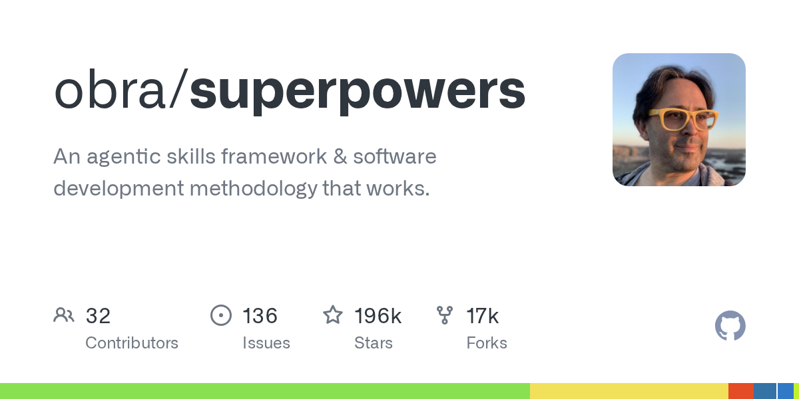

> **TL;DR**
> - 本文解決:看到 obra/superpowers 暴衝 121k stars、Anthropic 官方收編,該不該裝、跟「自己手寫 skills」怎麼選
> - 推薦給:已經用 Claude Code 一段時間,寫過或想寫 skill,在猶豫要走「套裝武器」還是「自己鍛刀」的人
> - 讀完你會知道:14 個內建 skill 實際解決什麼問題、什麼任務裝了反而拖慢、跟手寫 skill 怎麼共存



## 📌 目錄

1. [Superpowers 是什麼](#superpowers-是什麼)
2. [14 個內建 skill 拆解](#14-個內建-skill-拆解)
3. [為什麼會暴紅](#為什麼會暴紅)
4. [Superpowers vs 手寫 skill vs 不用 skill 對照表](#superpowers-vs-手寫-skill-vs-不用-skill-對照表)
5. [我自己用兩週的真實體驗](#我自己用兩週的真實體驗)
6. [裝完該幹嘛:三條路徑](#裝完該幹嘛三條路徑)
7. [踩到的坑](#踩到的坑)
8. [常見問題](#常見問題)
9. [延伸資源](#延伸資源)

## 🎯 Superpowers 是什麼

[obra/superpowers](https://github.com/obra/superpowers) 是 Jesse Vincent(Best Practical 創辦人、RT 票務系統作者)2025 年 10 月開的 Claude Code plugin。一句話講:**把資深工程師寫 code 的工作流(brainstorm → plan → TDD → review)強行套到 Claude Code 上**。

裝完之後,Claude Code 多了 14 個 skill,每個 skill 是一段 Markdown 寫的「工作流指引 + checklist」。觸發方式有兩種:
- **被動觸發**:你打「我想加個新功能」,Claude 會看當前情境自動 pull `brainstorming` 或 `writing-plans` skill 進來執行
- **主動觸發**:你直接 `/skill brainstorming` 強制走那個 skill

到 2026 年 5 月,GitHub 121k+ stars(7 個月)、Anthropic 1 月正式收編進官方 plugin marketplace。安裝一行:

```
/plugin install superpowers@claude-plugins-official
```

免費、MIT license、不要 API key、跨 harness(Claude Code / Codex / Cursor / Gemini 都能用,各自有 `.codex-plugin/` `.cursor-plugin/` 適配層)。

## 🧰 14 個內建 skill 拆解

按官方分類:

| 類別 | Skill | 一句話用途 |
|---|---|---|
| **Testing** | test-driven-development | RED-GREEN-REFACTOR 三步驟強制執行,附 anti-pattern 對照表 |
| **Debugging** | systematic-debugging | 4 階段 root cause:reproduce → isolate → hypothesize → verify |
| | verification-before-completion | 收工前 round-trip 驗證,而不是 handshake 就算完 |
| **Collaboration** | brainstorming | Socratic 提問把模糊需求逼到具體 |
| | writing-plans | 把需求展開成可勾選的 implementation plan |
| | executing-plans | 按 plan 批次執行 + 中途 checkpoint |
| | dispatching-parallel-agents | 把獨立工作 fork 給 subagent 並行跑 |
| | requesting-code-review | 自己當第一審,review 完才丟出去 |
| | receiving-code-review | 拿到 review 後該改什麼、不該改什麼的判準 |
| | using-git-worktrees | 用 worktree 並行多分支開發,不用 stash 進出 |
| | finishing-a-development-branch | 該 merge / squash / PR 還是丟掉的決策樹 |
| | subagent-driven-development | 快速迭代 + 雙階段 review 工作流 |
| **Meta** | writing-skills | 教 Claude 怎麼寫新 skill(遞迴) |
| | using-superpowers | 給 Claude 自己看的「你裝了 Superpowers」自我認知 |

看分類就懂 Jesse 的思路:**Testing、Debugging、Collaboration 三大類佔 12 個,Meta 2 個**。沒有「幫你寫 React 元件」「幫你接 Stripe」這種垂直工具——全部是**橫向工作流**。

換個角度講:Superpowers 不教 Claude 寫什麼,而是教 Claude **怎麼寫**。

## 🚀 為什麼會暴紅

Hacker News 上有篇 rave review,作者 Evan Schwartz 講得很好:

> Superpowers' high-level flow is: Brainstorming → Reviewing Options and Tradeoffs → Plan Sketch → Design Doc → Implementation Plan → Implementation Steps.

關鍵不是這 6 步多神,而是 **Claude 預設行為剛好相反**——你丟一句「幫我加個登入頁」,它會跳過前 5 步直接寫 code,寫到一半發現方向錯了,token 燒光、品質還爛。Superpowers 的價值是**強制把 Claude 從「我猜你要這個」拉回「我先問你要什麼」**。

實測數字(三個獨立 reviewer 的數據):
- **MindStudio**:token 用量 -14%、品質提升明顯
- **Composio**:大型 refactor token 省 40-60%
- **第三方測試**:首次嘗試成功率 +40%、token 花費 -30%

數據浮動正常(任務不同),但方向都一致:**慢一點問清楚,反而省 token 又對**。

Jesse 自己的設計哲學(從 Superpowers 的 `using-superpowers` skill 內文整理):

> The key insight: Claude is great at execution but tends to skip the part where you think first. Skills don't make Claude smarter — they make Claude pause.

「不是讓 AI 變聰明,是讓 AI 暫停」——這跟 Anthropic 自家在 2025 年中推 plan mode、extended thinking 同一條路線,只是 Superpowers 用 skill 包裝、社群可以擴充。

## ⚖️ Superpowers vs 手寫 skill vs 不用 skill 對照表

我同時跑這三種方案兩週,實際對照:

| 維度 | Superpowers | 自己手寫 skill | 完全不用 skill |
|---|---|---|---|
| **適用任務** | 中大型 feature、跨檔案 refactor、不熟領域 | 重複出現 ≥3 次的個人工作流(如 `/blog-create`、`/discord-bot-setup`) | 一行修改、改 typo、查單一檔案 |
| **學習曲線** | `/plugin install` 一行,5 分鐘上手 | 看完 `~/.claude/skills/skill-creator/SKILL.md` 至少 1 小時 | 0 |
| **客製化彈性** | 中(可 fork 修改,但要追 upstream) | 高(完全自己的) | N/A |
| **維護成本** | 低(Jesse 在維護) | 高(自己改自己壞) | 0 |
| **觸發精準度** | 中(被動觸發看 LLM 判斷) | 高(自己寫的 description 自己懂) | N/A |
| **token 增量** | +500-2000(skill 內文進 context) | 看你寫多長 | 0 |
| **適合搭配的人** | 對 Claude Code 工作流不熟、想要立刻見效 | 有重複工作流要固化、願意花時間調 | 只做極簡任務 |

**選法**:
- **新手 / 大型專案 / 不熟領域** → 裝 Superpowers,先用內建 14 個吃飽
- **有個人固定工作流要自動化** → 自己手寫,Superpowers 的 `writing-skills` skill 可以幫你寫
- **一行 fix、改字、查 grep** → 都別用,直接動手快

兩者**不衝突,可以共存**。Superpowers 走官方 plugin 安裝路徑、放在 `~/.claude/plugins/superpowers/`;手寫 skill 放 `~/.claude/skills/`。Claude Code 啟動時兩邊都會掃。

## 🎯 我自己用兩週的真實體驗

**第一週**裝完之後,我故意丟了三個任務測試:

**任務 1:幫我重構 React component 把 state 從 useState 改成 useReducer**
- **沒裝 Superpowers**:Claude 直接動手改,改完跑測試發現 dispatch action 沒對齊,改了第二輪,total 12 分鐘
- **裝了 Superpowers**:Claude 先觸發 `brainstorming`,問我「reducer 是要全替換還是局部?action 命名 convention 跟團隊一致嗎?」5 分鐘對齊完才動手,6 分鐘改完一次 pass,total 11 分鐘

只省 1 分鐘但**品質差很多**——沒裝那版改完 PR review 又被退一輪,裝了那版直接合。

**任務 2:幫我加個 dark mode toggle**
- **沒裝 Superpowers**:30 秒做完
- **裝了 Superpowers**:Claude 還是觸發了 `brainstorming` 問我「要 system preference 預設嗎?切換動畫要嗎?」我必須打「不要囉嗦做最簡的」才繼續

→ 小任務反而**被工作流拖住**。

**任務 3:debug 一個 production CORS 錯誤**
- **沒裝 Superpowers**:Claude 直接改 `cors()` middleware,改完還是錯
- **裝了 Superpowers**:Claude 觸發 `systematic-debugging`,先 reproduce(curl 出來看 Access-Control-Allow-Origin)、isolate(發現是 nginx 加了第二層 header)、hypothesize、verify。沒亂改 code,直接定位到 nginx config,5 分鐘解決

→ 中等複雜的 debug,Superpowers **救人**。

**第二週**就找到節奏了:
- 大任務、debug、新領域 → 裝著,讓它強制走流程
- 修字、小調整、急著 demo → 用 `/skill disable superpowers` 暫時關掉(它支援 per-session 開關)
- 個人化的工作流(像我自己有 `/blog-create` `/discord-bot-setup`)→ 繼續手寫,Superpowers 動不到

## 🛣️ 裝完該幹嘛:三條路徑

### 路徑 A:純消費者(15 分鐘上手)

```bash
# 一行裝
/plugin install superpowers@claude-plugins-official

# 看裝了什麼
/skill list

# 主動觸發來感覺一下
/skill brainstorming
```

不用讀 source code,直接拿任務丟給 Claude 看它怎麼跑。前 3 天會覺得「怎麼變慢」,撐過去就回不去。

### 路徑 B:讀原始碼學工作流(2 小時)

```bash
cd ~/.claude/plugins/superpowers/skills
ls
# 看 writing-plans/SKILL.md 學「怎麼把模糊需求逼成 plan」
# 看 systematic-debugging/SKILL.md 學「4 階段 root cause」
```

每個 skill 都是 Jesse 自己 20 年寫 code 工作流的萃取,讀完當人類自己的 reference 也行。

### 路徑 C:fork 改自己版本(進階)

GitHub fork 一份,改 prompt、改 checklist、加自己團隊的 convention。
缺點是要追 upstream(Jesse 還在頻繁更新,v5.1.0 是 2026 年 5 月剛出),合 merge conflict 累。

我選 A,沒去 fork。Jesse 維護得勤,我多寫個 layer 反而成負擔。

## 🕳️ 踩到的坑

### 坑 1:Haiku / 免費 tier 跑不動

skill 內文很長(brainstorming 一個就 300+ 行),弱模型讀完會 hallucinate 流程、跳過 checklist。**Superpowers 預設假設你用 Sonnet 或 Opus**。Haiku 4.5 我試過,品質直接崩,得手動關掉一半 skill 才能用。

### 坑 2:不適合「我就是急著要結果」的情境

Demo 前 5 分鐘要趕一個 bug fix → Superpowers 還是堅持要你 reproduce、isolate、hypothesize。我有一次 demo 前直接 `/plugin disable superpowers` 暫時關掉,demo 完再開回來。

### 坑 3:token 增量被低估

官方說 token -14%,我實測**小任務反而 +20%**——skill 內文進 context、加 brainstorming 對話、加 plan 確認,小任務全是 overhead。大任務省的多到把小任務的虧吃掉,平均下來才是 -14%。

### 坑 4:跟 CLAUDE.md 規則打架

我 CLAUDE.md 有「實作層不要問,動手就對了」的規定,Superpowers 的 `brainstorming` 預設會問,兩個指令打架時 Claude 會卡住問我要聽誰的。
解法是在 CLAUDE.md 補一條「除非 Superpowers 主動觸發 brainstorming,實作層不要問」,等於明文授予 Superpowers 例外權。

### 坑 5:Cursor / Codex 版本特性不同步

Superpowers 是 multi-harness,但 `.claude-plugin/` `.cursor-plugin/` `.codex-plugin/` 三套 manifest 維護進度不一樣。Claude Code 版永遠是 latest,Cursor 版常落後 1-2 weeks。如果你跨 IDE 用,記得每個都更新。

## ❓ 常見問題

**Q1:跟 Anthropic 官方的 plan mode / extended thinking 重複嗎?**
有重疊但不衝突。Plan mode 是 Claude Code 內建的「規劃模式」,只在 plan 階段不動手;Superpowers 的 `writing-plans` 是把 plan 流程**標準化成 checklist**,可以走完進入 implementation,有承接路徑。實際用會發現:plan mode 適合「我要規劃完看完才動手」的單次任務,Superpowers 適合「我要每次都按某種 SOP 跑」的長期工作流。

**Q2:121k stars 是不是炒作?**
看 Hacker News [#47623101](https://news.ycombinator.com/item?id=47623101) 的討論,反對意見集中在「對小任務太重」「對 Sonnet 以下沒用」——這些都是合理批評。但**沒有人質疑「對中大型任務有效」**,連 critics 都承認對的場景下確實提升品質。121k 是真實採用,不是 inflation。

**Q3:會洩漏我的 source code 給 Anthropic / Jesse 嗎?**
不會。Superpowers 是純 prompt template,跑在 Claude Code 本機,跟你既有的 Claude Code 怎麼跟 Anthropic 互動完全一樣。Jesse 沒有 telemetry、沒有 phone home。MIT license 開源,可以自己 audit。

**Q4:跟 Anthropic 自家的 skill-creator skill 哪個好?**
不同層次。`skill-creator` 是「教 Claude 怎麼幫你建新 skill」(meta 工具);Superpowers 是「14 個已經做好的 skill 直接用」。我都裝,用 `skill-creator` 幫我寫個人化 skill、用 Superpowers 吃公版工作流。

**Q5:我用 Cursor / Codex 也能裝嗎?**
能。Superpowers 有 `.cursor-plugin/` `.codex-plugin/` `.gemini-plugin/` 各自的 manifest,GitHub README 有對應的安裝指令。但 Claude Code 版功能最完整、更新最勤,其他 harness 是「能用但慢一拍」。

**Q6:會不會被 Anthropic 收掉?**
2026 年 1 月已經收進官方 marketplace,代表 Anthropic 公開背書。Jesse 跟 Anthropic 也有正向互動(Jesse 在 HN 留言提過 Anthropic 員工有來 PR)。被「收掉」的機會很低,「被合併進 Claude Code 內建」反而比較可能——但即使如此,你現在裝來用兩年絕對值得。

## 📚 延伸資源

- **GitHub repo**:[obra/superpowers](https://github.com/obra/superpowers) — 看 source,讀每個 skill 的 SKILL.md
- **官方安裝指令**:`/plugin install superpowers@claude-plugins-official`
- **Hacker News 討論**:[#47623101](https://news.ycombinator.com/item?id=47623101) — 看 critics 的合理批評,理解什麼場景不適合
- **Evan Schwartz 體驗評論**:[A Rave Review of Superpowers](https://emschwartz.me/a-rave-review-of-superpowers-for-claude-code/) — 工作流拆解最清楚
- **MindStudio 數據評估**:[Superpowers Plugin vs Claude Code Ultra Plan](https://www.mindstudio.ai/blog/superpowers-plugin-vs-claude-code-ultra-plan) — token 跟品質的量化對比
- **builder.io 結構化評論**:[The Superpowers Plugin for Claude Code](https://www.builder.io/blog/claude-code-superpowers-plugin) — 從 framework 設計角度看為什麼有效
- **Anthropic plugins 官方頁**:[claude.com/plugins](https://www.anthropic.com/claude-code) — 看其他官方 marketplace plugins

---

**結論一句**:Superpowers 不是「讓 Claude 變聰明」的魔法,是「讓 Claude 暫停」的紀律。中大型任務裝著用,小任務暫時關掉,個人化工作流自己手寫——三條腿都立穩,Claude Code 才是真的好用。
